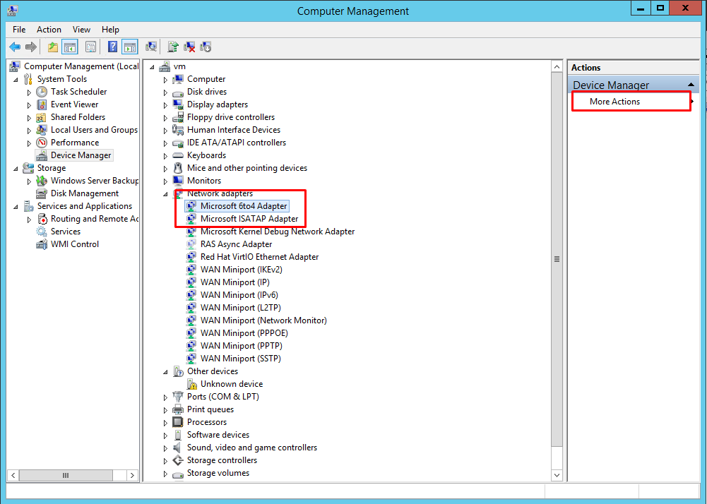

IPv6 supports three different addressing schemes for address configuration and for providing optional network information.

- Stateless Address Auto Configuration (SLAAC)
Address configuration using Router Advertisement (RA).
- DHCPv6-stateless
Address configuration using RA and optional information using DHCPv6.
- DHCPv6-stateful
Address configuration and optional information using DHCPv6.

OpenStack Networking only supports EUI-64 IPv6 address assignment for SLAAC. This allows for simplified IPv6 networking, as hosts will self-assign addresses based on the base 64-bits plus MAC address. Attempts to create subnets with a different netmask and address_assign_type of SLAAC will fail.


IPv6 Address -Configuration Modes If creating an IPv6 network, specifies how IPv6 addresses and additional information are allocated:

Khi ta tạo subnet trong OpenStack, ta sẽ có thêm 2 attributes đó là: ipv6_ra_mode và ipv6_address_model.

No Options Specified - Select this option if IP addresses are set manually, or a non OpenStack-aware method is used for address allocation.
SLAAC (Stateless Address Autoconfiguration) - Instances generate IPv6 addresses based on Router Advertisement (RA) messages sent from the OpenStack Networking router. This configuration results in an OpenStack Networking subnet created with ra_mode set to slaac and address_mode set to slaac.

DHCPv6 stateful - Instances receive IPv6 addresses as well as additional options (for example, DNS) from OpenStack Networking DHCPv6 service. This configuration results in a subnet created with `ra_mode` set to `dhcpv6-stateful` and `address_mode` set to `dhcpv6-stateful`.

`DHCPv6 stateless` - Instances generate IPv6 addresses based on Router Advertisement (RA) messages sent from the OpenStack Networking router. Additional options (for example, DNS) are allocated from the OpenStack Networking DHCPv6 service. This configuration results in a subnet created with `ra_mode` set to `dhcpv6-stateless` and` address_mode` set to `dhcpv6-stateless`.

Prefix delegation:
https://en.wikipedia.org/wiki/Prefix_delegation


cấu hình cho network để không cung cấp SLAAC prefix.
```
#ipv6.method dhcp
IPV6_AUTOCONF=no
DHCPV6C=yes
```
Will configure network settings by using DHCPv6, but not SLAAC

`IPV6_AUTOCONF=yes`	Will configure network settings using SLAAC from router advertisements.


Windows tự động hỗ trợ `IP 6TO4` : (chạy IPv4-Only trên hạ tầng IPv6 , vẫn kết nối được IPv6)

- 

Tạm chốt có 2 cách:
- Fix IP IPv6 vào file ifc-em1.
- Để động IPv6 nhưng cần chạy command `dhclient -6` để get IP 
**Tạo subnet dhcpv6-stateful**

https://wiki.archlinux.org/index.php/IPv6#NetworkManager


