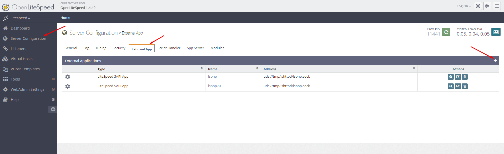
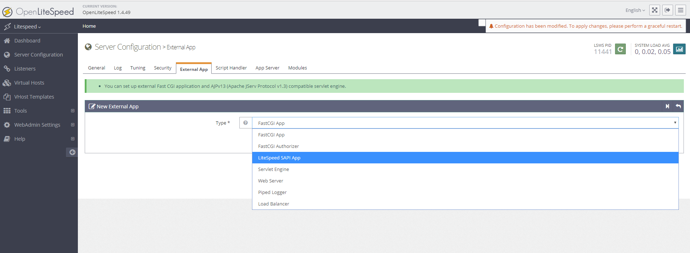
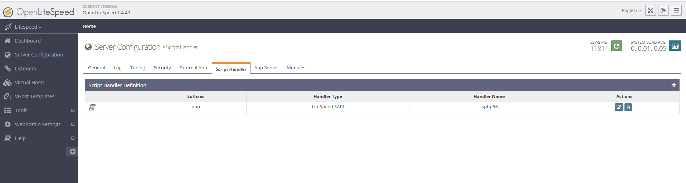
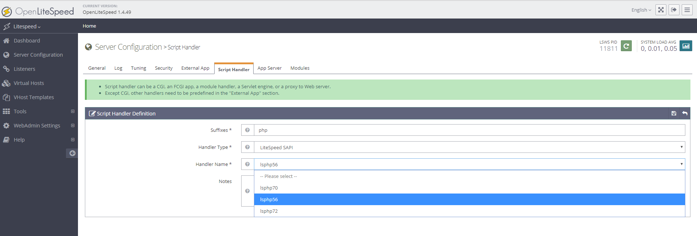
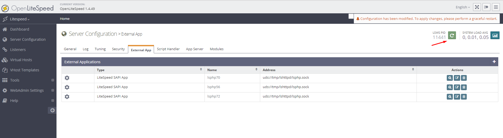
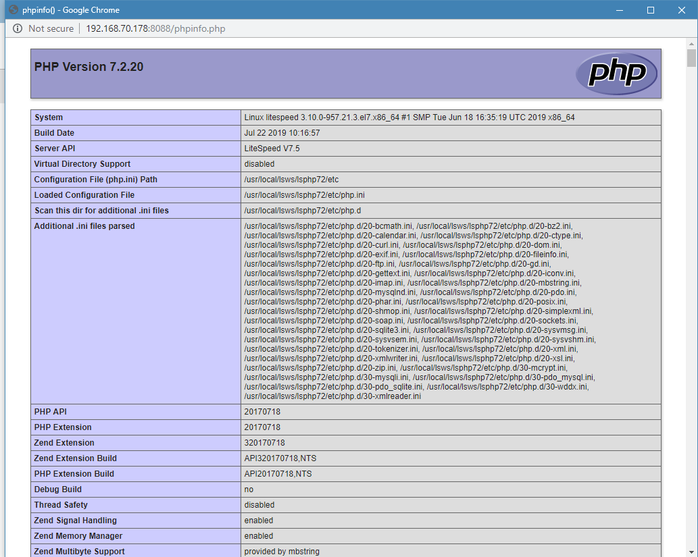
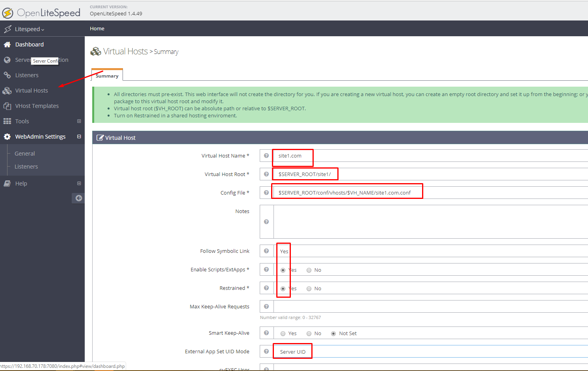
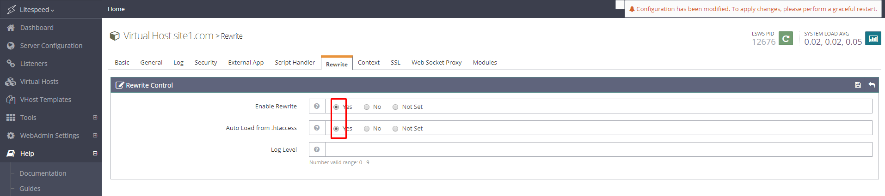
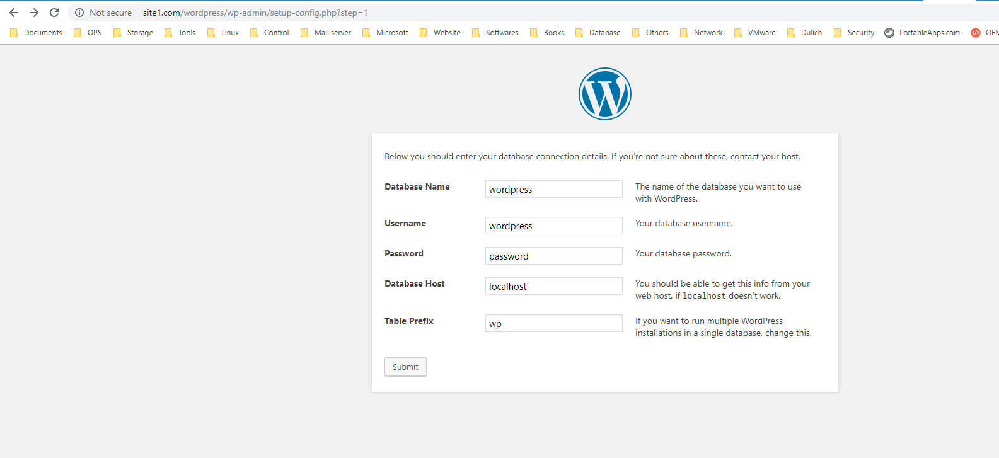

OLS được phát triển và xây dựng dựa trên các tiêu chí:

Hướng đến việc sử dụng càng ít tài nguyên (CPU, RAM)
Xử lý một số lượng lớn kết nối mà không gây quá tải
Giao diện quản trị với thống kê thời gian thật
Hỗ trợ mod_rewrite của Apache (Hỗ trợ .htaccess file nhưng ko phải tất cả rule)
Pagecache tích hợp sẵn
Hỗ trợ các kiểu I/O tăng hiệu năng đọc ghi tùy theo phiên bản Unix đang dùng (Linux Kernel 2.4 – 2.6/FreeBSD/OS X…)
Hỗ trợ plugin bên thứ 3 qua API
Ngoài ra có thể đọc thêm tại đây (tiếng anh)

Hệ điều hành hỗ trợ:
CentOS 5, 6 và 7
Ubuntu 8.04 và các phiên bản sau
Debian 4 và các phiên bản sau
Solaris(x86): Sun0S 5.8 và các phiên bản sau
OS X 10.3 và các phiên bản sau
FreeBSD 4.5 và các phiên bản sau

## 1. Cài LiteSpeed Webserver:

```sh
yum -y install wget zip unzip epel-release && yum clean all && yum update
```
```
rpm -ivh http://rpms.litespeedtech.com/centos/litespeed-repo-1.1-1.el7.noarch.rpm
yum install openlitespeed -y
```

Default OLS installation directory is: /usr/local/lsws

To start the server, simply run /usr/local/lsws/bin/lswsctrl start. (To stop it, run /usr/local/lsws/bin/lswsctrl stop.)


http://192.168.70.178:8088/

admin : https://192.168.70.178:7080/

Cập nhật admin password
sh /usr/local/lsws/admin/misc/admpass.sh


## 2. Cài đặt PHP
```sh
yum install lsphp56 lsphp56-common lsphp56-mysql lsphp56-gd lsphp56-process lsphp56-mbstring lsphp56-xml lsphp56-mcrypt lsphp56-pdo lsphp56-imap lsphp56-soap lsphp56-bcmath -y
```

```sh
yum install lsphp72 lsphp72-common lsphp72-mysqlnd lsphp72-gd lsphp72-process lsphp72-mbstring lsphp72-xml lsphp72-mcrypt lsphp72-pdo lsphp72-imap lsphp72-soap lsphp72-bcmath -y
```


yum install lsphp71 lsphp71-common lsphp71-mysqlnd lsphp71-gd lsphp71-process lsphp71-mbstring lsphp71-xml lsphp71-mcrypt lsphp71-pdo lsphp71-imap lsphp71-soap lsphp71-bcmath -y


Thư mục cài đặt mặc định: `/usr/local/lsws/lsphp56/bin/php`


yum groupinstall lsphp-all
/usr/local/lsws/bin/lswsctrl restart

**Cấu hình multi version PHP**





Thêm vào cấu hình như bên dưới:
```
Name: lsphp72
Address: uds://tmp/lshttpd/lsphp.sock
Max Connections: 35
Environment:
PHP_LSAPI_MAX_REQUESTS=500
PHP_LSAPI_CHILDREN=35
Initial Request Timeout (secs): 60
Retry Timeout : 0
Response Buffering: no
Start By Server: yes
Command: $SERVER_ROOT/lsphp72/bin/lsphp
Back Log: 100
Instances: 1
Memory Soft Limit (bytes): 2047M
Memory Hard Limit (bytes): 2047M
Process Soft Limit: 400
Process Hard Limit: 500
```
- Click icon Save ở góc phải để lưu lại cấu hình.

- Thực hiện việc thay đổi version PHP:
- Server Configuration > Script Handler > Edit



- Chọn version PHP:



- Restart lại LS



- Vào địa chỉ `http://192.168.70.178:8088/` để kiểm tra version PHP:




File cấu hình php.ini:

/usr/local/lsws/lsphp72/etc/php.ini

- để dễ sử dụng hơn tạo link (đối với PHP 5.6) :
```sh
ln -s /usr/local/lsws/lsphp56/bin/php /usr/bin/php
ln -s /usr/local/lsws/lsphp56/bin/phpize /usr/bin/phpize
ln -s /usr/local/lsws/lsphp56/bin/pear /usr/bin/pear
ln -s /usr/local/lsws/lsphp56/bin/pecl /usr/sbin/pecl
```

## 3. Cài đặt Maria DB

- Chạy lệnh sau để cài đặt Maria DB: 
```sh
yum install mariadb mariadb-server -y
```

Chạy Maria DB với lệnh sau: 
```
systemctl start mariadb.service
systemctl enable mariadb.service
```

```sh
/usr/bin/mysql_secure_installation
```

Đầu tiên nó sẽ hỏi bạn Enter current password for root. Lúc này bạn chưa có bạn password cho root nên cứ gõ Enter. 

Tiếp theo nó hỏi Set Root Password? bạn gõ y rồi nhập vào một password cho tài khoản root.

Những câu hỏi sau này bạn cứ chọn y hết. ​

Cuối cùng bạn khởi động lại Maria DB: 
```
systemctl restart mariadb.service
```


Đổi Port cho OLS
OpenLiteSpeed khi cài đặt sẽ chạy trên port 8088 chứ không phải port 80 như bình thường.

Truy cập Listeners > Nhấn vào Default hoặc nút edit bên phải

Đổi Port từ 8088 thành 80


## 4. Cài đặt Wordpress :

- Tạo Vhost cho site mới :



- Enable Rewrite :


- Sau khi Enable click nút Graceful Restart .

- Sau khi tạo DB và user truy cập vào site để cài đặt Wordpress


https://www.litespeedtech.com/support/wiki/doku.php/litespeed_wiki:php:rpm